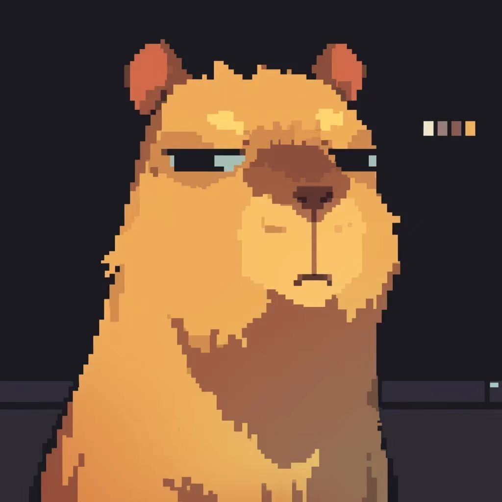

  

<h1 align="center">👾 José Guilherme | Full Stack Developer</h1>

  

---

## 🎮 Sobre Mim

* 🧑‍💻 **Nome:** José Guilherme da S. Neto 
* 🏫 **Formação:** IFRN – Campus Canguaretama  
* ⚡ **Classe:** Desenvolvedor **Full Stack**  

---

## 🦫

  

---

## ⚡ Power-Ups (Stack)

  

  
  
  
  

---

## 📂 Repositórios em Destaque

| Projeto               | Descrição                                      |
|-----------------------|------------------------------------------------|
| **Repo_Java**         | Exercícios e estudos em Java                   |
| **BibliotecaPessoal** | Sistema de biblioteca em Python                |
| **BootCamp_C#**       | Projetos desenvolvidos em C# e .NET            |

---

## 📊 

  
  

  

  

  

---

## 🌐 Onde me encontrar

  
  
  
  

---

---

  

  

