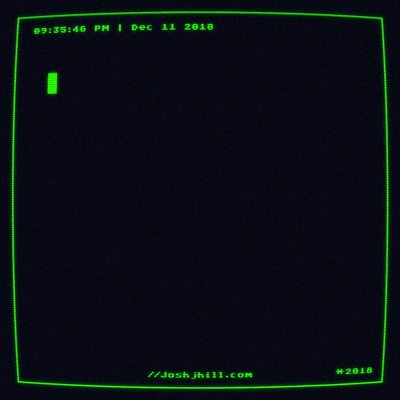

  

<h1 align="center">👾 José Guilherme (JGuilhermeSneto) | Full Stack Developer</h1>

  

---

## 🎮 Sobre Mim

* 👨‍💻 **Nome:** José Guilherme da S. Neto ( **JGuilhermeSneto**)  
* 🏫 **Formação:** Aluno do IFRN – Campus Canguaretama  
* 🚀 Sempre evoluindo em **Clean Code**, **Arquitetura de Software** e **DevOps**

---

## ⚡ Power-Ups (Stack)

  

---

## 🗺️ Roadmap de Evolução
- [x] Programação em Java e POO sólida  
- [x] Backend com Python (Django)  
- [ ] Clean Code + Boas Práticas de Arquitetura  
- [ ] DevOps: CI/CD, Docker e GitHub Actions  
- [ ] Cloud Deployment (AWS ou similar)

---

## 📂 Repositórios em Destaque

| Projeto               | Descrição                                      |
|-----------------------|------------------------------------------------|
| **Repo_Java**         | Exercícios e estudos em Java                   |
| **BibliotecaPessoal** | Sistema de biblioteca em Python                |
| **BootCamp_C-**       | Projetos desenvolvidos em C# e .NET            |

---

  

---

  

---

## 📞 Contato

  

  

